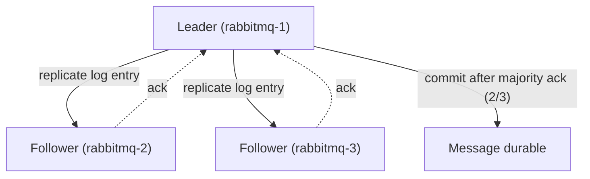

# Теория: Кластеризация и Quorum Queues

> Дополняет [Кейс 8](../README.md#кейс-8-симуляция-кластера--2-узла-с-quorum-queues) и [Кейс отладки №4/№5](../README.md#кейсы-для-отладки).

## 1. Зачем кластеризация

Один узел RabbitMQ — это единая точка отказа: падение узла = остановка всех очередей на нём. Кластер из нескольких узлов позволяет:

- реплицировать очереди (Quorum Queues) между узлами;
- продолжать обслуживать клиентов при падении части узлов;
- горизонтально распределять нагрузку по подключениям/каналам (сами очереди при этом физически размещены на конкретных узлах).

## 2. Erlang Cookie

RabbitMQ построен на Erlang/OTP, и узлы одного кластера аутентифицируют друг друга общим секретом — **Erlang cookie** (файл `.erlang.cookie` или переменная `RABBITMQ_ERLANG_COOKIE`). Если cookie на узлах не совпадает, `join_cluster` завершится ошибкой аутентификации. В [`docker-compose.cluster.yml`](../docker-compose.cluster.yml) оба узла получают одинаковый `RABBITMQ_ERLANG_COOKIE`.

## 3. Classic Mirrored Queues vs Quorum Queues

| | Classic Mirrored Queues | Quorum Queues |
|---|---|---|
| Статус | **Deprecated**, удалены в RabbitMQ 4.x | Рекомендуемый способ HA |
| Алгоритм репликации | Master/mirror, без консенсуса | Raft-консенсус |
| Поведение при split-brain | Риск расхождения данных | Безопасно — работает только большинство (majority) |
| Как включить | Policy `ha-mode` | `arguments: {"x-queue-type": "quorum"}` при объявлении очереди |

**Итог:** в продакшене всегда используйте Quorum Queues.

## 4. Как работает Raft в Quorum Queues (простыми словами)



- У каждой quorum-очереди есть **leader** (принимает publish/ack) и **followers** (реплики).
- Сообщение считается зафиксированным (durable), когда его подтвердило **большинство** реплик (majority), а не все.
- Именно поэтому рекомендуется **нечётное количество узлов** (3, 5, 7): при 3 узлах кластер переживает падение 1 узла (2 из 3 — это ещё большинство).
- На 2 узлах (как в учебном `docker-compose.cluster.yml`) majority = 2 из 2, то есть падение любого узла останавливает queue — это ок для обучения, но недопустимо в проде.

## 5. Partition handling — что происходит при split пары узлов

Когда узлы кластера теряют связь друг с другом (network partition), у каждой «стороны» может быть собственное представление о состоянии кластера. Параметр `cluster_partition_handling` определяет стратегию восстановления:

| Стратегия | Поведение | Когда использовать |
|-----------|-----------|---------------------|
| `ignore` (по умолчанию) | Ничего не делает — риск split-brain | Никогда в проде |
| `autoheal` | После восстановления связи кластер автоматически «залечивается», выбирая сторону с наибольшим числом клиентских подключений | Небольшие кластеры (2-3 узла), где downtime важнее строгой консистентности |
| `pause_minority` | Узлы в меньшинстве сами приостанавливают Erlang-приложение, пока не восстановится связь | Кластеры 3+ узлов, где важна консистентность |

## 6. Базовые команды `rabbitmqctl`

```bash
# Статус кластера и partition
rabbitmqctl cluster_status

# Присоединить текущий узел к существующему кластеру
rabbitmqctl stop_app
rabbitmqctl reset
rabbitmqctl join_cluster rabbit@rabbitmq-1
rabbitmqctl start_app

# Корректно вывести узел из кластера (перед выключением!)
rabbitmqctl forget_cluster_node rabbit@rabbitmq-2

# Список очередей с типом и лидером
rabbitmqctl list_queues name type leader --formatter pretty_table
```

> Забытая команда `forget_cluster_node` — частая причина, почему «удалённый» узел продолжает фигурировать в `cluster_status`.

## 7. Практика

Пройдите [Кейс 8](../README.md#кейс-8-симуляция-кластера--2-узла-с-quorum-queues), а затем — [Кейсы отладки №4 и №5](../README.md#кейсы-для-отладки), чтобы потренироваться диагностировать partition и leader failover.
