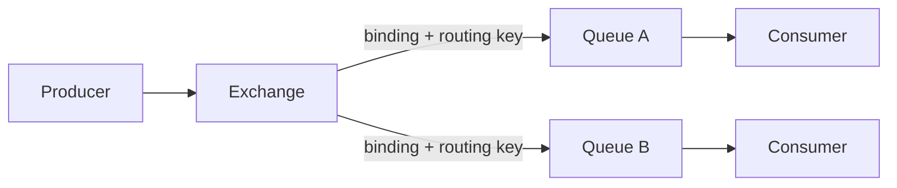
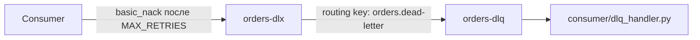

# Теория: Exchanges, Queues, Bindings

> Этот документ объясняет модель AMQP 0-9-1, на которой построен RabbitMQ, и то, как она реализована в файле [`definitions.json`](../definitions.json) этой лабораторной работы.

## 1. Модель AMQP в двух словах

Producer никогда не отправляет сообщение прямо в очередь. Сообщение всегда публикуется в **exchange**, а exchange по правилам маршрутизации (**bindings** и **routing key**) решает, в какие очереди его разложить.



Если сообщение не подходит ни под один binding — оно теряется (если exchange не `mandatory`) либо возвращается producer-у (basic.return), либо попадает в очередь unroutable в зависимости от настроек публикации.

## 2. Типы exchange

| Тип | Как маршрутизирует | Пример из лабы |
|-----|---------------------|----------------|
| `direct` | Точное совпадение routing key с binding key | `orders-direct` → routing key `order.new` → очередь `orders` |
| `fanout` | Игнорирует routing key, шлёт во ВСЕ привязанные очереди | `orders-fanout` → `orders-fanout-q1` и `orders-fanout-q2` |
| `topic` | Совпадение по паттерну (`*` — одно слово, `#` — любое число слов) | `orders-topic` → `order.*.urgent` и `order.*.regular` |
| `headers` | Маршрутизация по заголовкам сообщения, а не routing key | Не используется в этой лабе |

В [`definitions.json`](../definitions.json) объявлены четыре exchange: `orders-direct`, `orders-fanout`, `orders-topic` и `orders-dlx` (fanout, используется как Dead Letter Exchange).

## 3. Очереди (queues)

Очередь — это буфер сообщений на диске/в памяти. Ключевые свойства:

- **durable** — переживает перезапуск брокера (в этой лабе все очереди durable).
- **auto_delete** — удаляется, когда отключается последний consumer.
- **arguments** — служебные настройки:
  - `x-max-priority` — включает приоритетную очередь (см. `orders`, приоритет 0-10).
  - `x-dead-letter-exchange` / `x-dead-letter-routing-key` — куда пересылать сообщения, которые были nack-нуты, истёк TTL или превышена длина очереди.
  - `x-message-ttl` — время жизни сообщения в очереди (не задано по умолчанию в этой лабе — см. кейс отладки №3).

## 4. Bindings и routing key

Binding — это правило «эта очередь подписана на такие-то сообщения из этого exchange». `producer/producer.py` формирует routing key динамически в `get_routing_key()`:

```python
if priority >= 7:
    return f"order.{otype}.urgent"
else:
    return f"order.{otype}.regular"
```

А `get_exchange()` выбирает exchange по типу заказа:

| order_type | Exchange | Итоговая очередь |
|------------|----------|-------------------|
| `standard` | `orders-direct` | `orders` (routing key `order.new`) |
| `express`  | `orders-topic`  | `orders-topic-urgent` (priority ≥ 7) или `orders-topic-regular` |
| `bulk`     | `orders-fanout` | `orders-fanout-q1` **и** `orders-fanout-q2` одновременно |

## 5. Publisher confirms и consumer acknowledgements

Это два независимых механизма надёжности:

- **Publisher confirms** — брокер подтверждает producer-у, что сообщение принято (записано на диск/реплицировано). В `producer.py` включается через `channel.confirm_delivery()`.
- **Consumer acknowledgements** — consumer явно подтверждает (`basic_ack`) или отклоняет (`basic_nack`) обработку сообщения. В `consumer.py` используется `auto_ack=False` — это обязательное правило для production (см. корень репозитория, README, раздел «Production: как надо и как не надо»).

## 6. Dead Letter Exchange (DLX) в этой лабе



`consumer/consumer.py` считает попытки через заголовок `x-retry-count` и после `MAX_RETRIES` публикует сообщение напрямую в `orders-dlx` (см. `send_to_dlq()`). Отдельный фоновый поток `consumer/dlq_handler.py` слушает `orders-dlq` и логирует причину сбоя.

## 7. Что дальше

- Практика: [Лабораторные кейсы 1-5](../README.md#лабораторные-кейсы) в корневом README.
- Теория кластеризации: [`docs/clustering.md`](clustering.md).
- Теория мониторинга: [`docs/monitoring.md`](monitoring.md).
